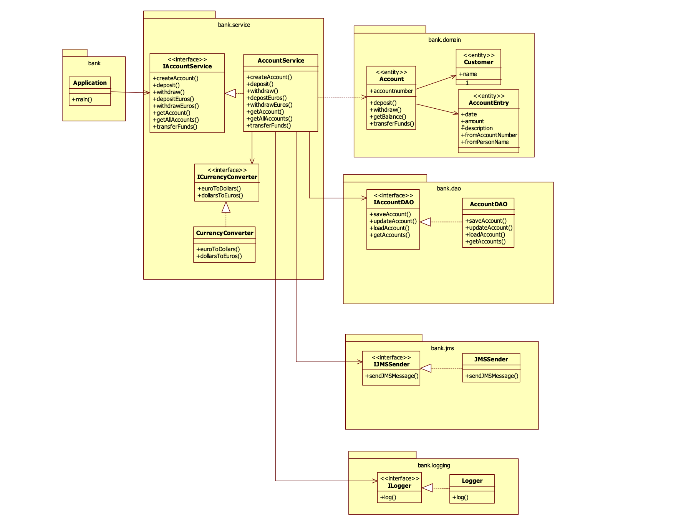

# Banking Application

## Overview

The banking application is a Java-based project developed using the Spring Framework to provide various functionalities related to account management, customer interactions, messaging, and currency conversion. It leverages Spring Boot for simplified setup and configuration.

## Project Structure

The project is structured into several packages and classes:

### bank.domain

Contains domain entities such as `Account`, `AccountEntry`, and `Customer`.

### bank.dao

Provides data access interfaces (`IAccountDAO`, `IAccountChangeEventDAO`) using Spring Data JPA for interacting with the database.

### bank.service

Includes service classes responsible for business logic implementation:

- `AccountService`: Manages accounts, deposits, withdrawals, transfers, etc.
- `BankStatementPrinter`: Prints bank statements.
- `CurrencyConverter`: Converts currencies.
- `CustomerAdapter`: Converts between `Customer` and `CustomerDTO`.
- `EventEmailer`: Sends email notifications for account change events.
- `EventPersistenceSaver`: Persists account change events.
- `IAccountService`: Defines account-related operations interface.
- `ICurrencyConverter`: Defines currency conversion interface.

### bank.integration

Contains classes for integrating with external systems:

- `email`: `EmailSender` for sending email notifications.
- `jms`: `JMSSender` and `IJMSSender` for sending messages via JMS.

### bank.logging

Handles logging functionality using `ILogger` and `Logger`.

### bank.web

Includes classes related to the web layer:

- `AccountController`: Implements REST endpoints for account management.
- `Accounts`: Represents a collection of `AccountDTO` objects.

### bank.aop

Contains classes for Aspect-Oriented Programming (AOP):

- `DaoLoggingAdvice`: Logs method calls on DAO classes.
- `JmsLoggingAdvice`: Logs JMS message sending.
- `ServiceTimerAdvice`: Measures and logs service method execution time.

### bank.messaging

Provides messaging functionality using Kafka:

- `AccountInstruction`: Represents instructions/messages related to account operations.
- `AccountListener`: Listens for messages from Kafka and triggers corresponding account operations.

### bank.service.messaging

Contains classes related to messaging within the service layer:

- `EventEmailer`: Sends email notifications for account change events.
- `EventPersistenceSaver`: Persists account change events.

### bank

Main package containing the entry point of the application:

- `Application`: Main class annotated with `@SpringBootApplication`.

## Functionality Overview

The banking application provides the following key functionalities:

1. **Account Management**: Creation, retrieval, and listing of accounts; deposits, withdrawals, and fund transfers; currency conversion.
2. **Customer Interaction**: Creation and retrieval of customer information.
3. **Messaging**: Sending email notifications; receiving and processing messages from Kafka.
4. **Logging and Monitoring**: Method call logging, JMS message logging, logging account change events.

## Technologies Used

- Java
- Spring Boot
- Spring Data JPA
- Spring Web MVC
- JMS
- Spring AOP
- Spring Scheduling
- Hibernate (for ORM)
- Apache Kafka
- MySQL
- Maven
- JSON
- Log4j
- JUnit
